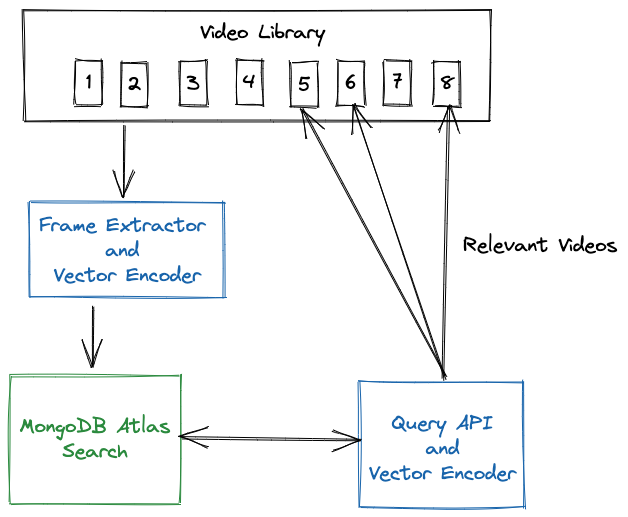

# Atlas Vector Search Across Videos
## Introduction
This demo is a prototype of how Atlas Vector Search could be used to find videos with relevent content - requiring that no descriptive metadata be stored along with the videos.  

To begin, image stills are extracted from the videos at a configurable number of seconds. The images (frames) are then encoded into a 768 dimensional dense vector space. The vector, along with the name of the video are stored into MongoDB Atlas. For the purpose of this demo, no other descriptive meta data about the video is stored. 

Then, using an Atlas Vector Search index, we demonstrate how the video library can be queried for content. The results include the name of the video and the second marker where the queried content was found.



## Setup
### Videos to Query
For this demo, the image extractor opens the videos from a local directory. To get started, I've supplied 6 sample videos that I downloaded from [Pexels](https://www.pexels.com/videos/}), They're pretty short and simple videos, so please try with your own.

### Atlas
Open [params.py](params.py) and configure your connection to Atlas, along with the name of the database and collection you'd like to store your text. 
### Extract and Encode the PDFs
Install the requirements. This implementation uses:
* [opencv-python](https://pypi.org/project/opencv-python/) Python library for frame extraction
* Hugging Face [sentence-transformers/clip-ViT-L-14](https://huggingface.co/sentence-transformers/clip-ViT-L-14) pretrained model for the dense vector mapping of the extrated video frames.
* [pymongo](https://pypi.org/project/pymongo/) - the Python driver for MongoDB

```zsh
pip install -r requirements.txt
```


Run the [extract_frames.py](extract_frames.py)
```python
python3 extract_frames.py
```
### Create Search Index
Create a default search index on the collection, which is `VectorSearchDemo.video` if you're using the supplied default:
```json
{
  "mappings": {
    "dynamic": true,
    "fields": {
      "frameVector": {
        "dimensions": 768,
        "similarity": "cosine",
        "type": "knnVector"
      }
    }
  }
}
```

## Demo
You are now ready to search your vast video library.

Your query will be mapped using the same transformer that was used to encode the data and then submitted to Atlas Search, returning the top 3 matches.

For example:

```zsh
✗ python3 find_video.py -q "bicycle"

The following videos may contain relevant content:
--------------------------------------------------
video:      bike.mp4
Second:     1
Frame:      120 

video:      street.mp4
Second:     1
Frame:      60 

video:      street.mp4
Second:     2
Frame:      120 
```

## The Search Query
This is the simple query passed to MongoDB:

```json
[
    {
        "$search": {
            "knnBeta": {
                "vector": query_vector,
                "path": "frameVector",
                "k": 15
            }
        }
    },
    {
        "$limit": 3
    }
]
```

The knnBeta operator uses the [Hierarchical Navigable Small Worlds](https://arxiv.org/abs/1603.09320) algorithm to perform semantic search. You can use Atlas Search support for kNN query to search similar to a selected product, search for images, etc.


